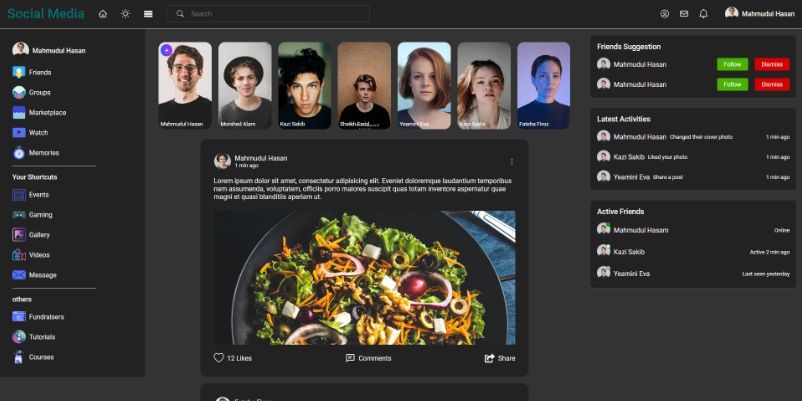

## Full Stack Social Media App

## Frontend 

* vite tooling
* React
* scss, scss mixins
* Context
* React router
* [axios](https://axios-http.com/docs/intro) for API request 
* Tanstack query

> More details [Frontend details](./client/README.md) 

## Backend 

* Node JS
* Mysql for database

> More details [Backend details](./api/ReadMe.md)

## Tools 

* Postman
* phpmyadmin
* Laragon

## Resources 

* [React Node.js MySQL Social Media App Tutorial | Full Stack Social Network App](https://youtu.be/1EuNnZEp2sQ)

1:02:48