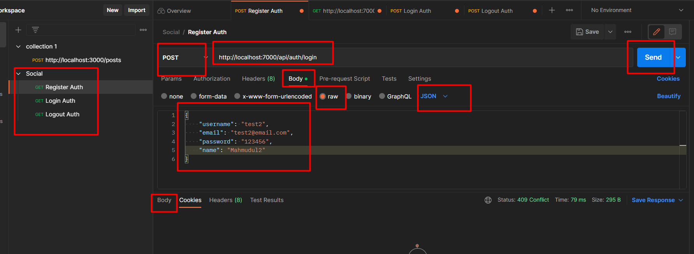

## Social Media Backend 

Tech stack

* Node JS
* MySql

## Database Relationships

* `one-to-many` & it's sign is `<`
* `many-to-one` & it's sign is `>`
* `one-to-one` & it's sign is `-`
* `many-to-many` & it's sign is `<>`

## 5 keys supported by MySQL

* Primary Key
* Unique Key
* Candidate Key
* Foreign Key
* Super Key

## [Project Database table structure](./dbtable.md) 

## Install these pack

* `npm i express mysql nodemon`, `npm init -y`, `npm i bcrypt`, `npm i jsonwebtoken`, `npm i cookie-parser`, `npm i cors`

## Tools we use

* Postman

* phpmyadmin
* Laragon

