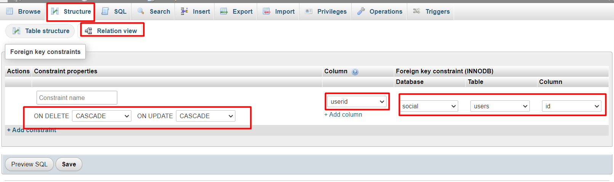

## DB Table

* db name `social`

* users
    * uid `int` [primary key, unique, not null, increment, note: 'uid is for user id']
    * username `varchar(30)` [not null]
    * email `varchar(40)` [not null]
    * password `varchar(100)` [not null]
    * name `varchar(30)` [not null]
    * coverPic `varchar(100)` [null]
    * city `varchar(30)` [null]
    * website `varchar(30)` [null]

* posts
    * pid `int` [primary key, unique, not null, increment, note: 'pid is for post id']
    * desc `varchar(300)` [null]
    * img `varchar(300)` [null]
    * puid `int` [foreign key: posts.puid > users.uid, not null, note: 'puid is for post user id, on update cascade on delete cascade'] 
    * createdat `datetime`

* comments
    * cid `int` [primary key, unique, not null, increment, note: 'cid is for comment id']
    * comment `varchar(300)` [not null]
    * createdat `datetime`
    * cuid `int` [foreign key: comment.cuid > users.uid, not null, note: 'cuid is for comment user id, on update cascade on delete cascade']
    * postid `int` [foreign key: comments.postid > posts.pid, not null, not null, on update cascade on delete cascade']

* stories 
    * sid `int` [primary key, unique, not null, increment, note: 'sid is for story id']
    * img `varchar(300)` [not null]
    * suid `int` [foreign key: stories.suid > users.uid, not null, note: 'suid is for story user id, on update cascade on delete cascade']

* relationships
    * rid `int` [primary key, unique, not null, increment, note: 'rid is for relationships id']
    * fruid `int` [foreign key: relationships.fruid > users.uid, not null, note: 'fruid is for follower user id, on update cascade on delete cascade']
    * fduid `int` [foreign key: relationships.fduid > users.uid, not null, note: 'fruid is for followed user id, on update cascade on delete cascade']

* likes 
    * lid `int` [primary key, unique, not null, increment, note: 'lid is likes id']
    * luid `int` [foreign key: likes.luid > posts.puid, not null, note: 'luid is likes user id, on update cascade on delete cascade']
    * likedpostid `int` [foreign key: likes.likedpostid > users.uid, not null, note: on update cascade on delete cascade']